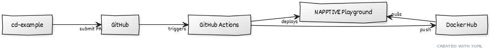
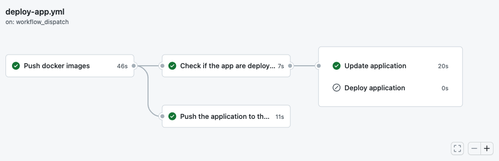

# A continous delivery example on the NAPPTIVE Playground

Cloud Native applications benefit from having a consolidated Continuous Integration pipeline, that sometimes may be linked with a Continous deployment stage. This repository demonstrates how the NAPPTIVE Playground can be integrated with GitHub Actions to trigger the deployment of an application after a CI stage passes.

<!-- [cd-example]- submit PR >[GitHub]--triggers >[GitHub Actions]--deploys>[NAPPTIVE Playground]
[GitHub Actions]-- push>[Docker Hub]
[NAPPTIVE Playground] pulls >[Docker Hub] -->




In this example we will explore how to create a GitHub Action that is triggered every time a pull request is submitted (or a change to the main branch is pushed). The Action will produce the required manifest after pushing the newer docker image, and will trigger the deployment or update of the existing application in the [NAPPTIVE Playground](https://napptive.com/playground).

## The target application

For the purpose of this example, we have create a very simple golang application which provides an HTTP server that will respond with a default message every time it receives a request.

**[main.go](cmd/cd-example/main.go)**

```
...
// HelloHandler will return 200 OK plus a message.
func (s *SimpleHTTPServer) HelloHandler(w http.ResponseWriter, r *http.Request) {
	w.WriteHeader(http.StatusOK)
	fmt.Fprint(w, fmt.Sprintf(DefaultMessage, Version, Commit))
}
...
```

To deploy the application in Kubernetes, we use the Open Application Model to simplify how we describe our application.

**[application.yaml](deployments/020.cd-example.appconfig.yaml)**

```
apiVersion: core.oam.dev/v1alpha2
kind: ApplicationConfiguration
metadata:
  name: cd-example
  annotations:
    version: 1.0.0
    description: "A simple application to illustrate continous deployment on the NAPPTIVE Playground"
spec:
  components:
    - componentName: cd-example
      traits:
        - trait:
            apiVersion: core.napptive.com/v1alpha1
            kind: Ingress
            metadata:
              name: cd-example-ingress
            spec:
              name: cd-example
              protocol: HTTP
              port: 8080
              path: /
              rewritePath: /
```
Notice that the application defines which components are part of our application, and in this case applies a trait to expose the application to the outside. This will generate a public endpoint that we can connect to. The application entity references a [component](deployments/010.cd-example.component.yaml) that defines how to run the application.

<details>
<summary>component</summary>

```
apiVersion: core.oam.dev/v1alpha2
kind: Component
metadata:
  name: cd-example
spec:
  workload:
    apiVersion: core.oam.dev/v1alpha2
    kind: ContainerizedWorkload
    metadata:
      name: cd-example
    spec:
      osType: linux
      containers:
        - name: cd-example
          securityContext:
            runAsUser: 1001
          image: TARGET_DOCKER_REGISTRY/cd-example:VERSION
          imagePullPolicy: Always
          resources:
            cpu:
              required: 150m
            memory:
              required: 256Mi
          ports:
            - name: http
              value: 8080
              containerPort: 8080
              type: tcp

```
</details>

## The GitHub Action

For the [GitHub Action](https://github.com/features/actions), we define one that is triggered by a merge operation following the classic git approach for submitting new code to a repository. The [action](.github/workflows/upon_merge.yml) executes the following workflow:


* **Setup Go environment** and **Checkout code** are standard operations to get the code that has been submitted on an environment with the required development tools.

* **Publish docker images and create manifest** builds the docker image and pushes it to [Docker Hub](hub.docker.com) using your credentials. The action expect the credentials to be stored in secrets: `DOCKER_HUB_USER` and `DOCKER_HUB_TOKEN`. After that, builds the YAML files that are required to deploy the application. This operation uses two environment variables `VERSION` and `TARGET_DOCKER_REGISTRY` to define where the image will be pushed and which version will be associated with the upload. **Edit the action code to substitute the value with your user.***

* **Push the application to the catalog** upload the new application to Napptive Catalog.

* **Check the application** Checks if the applcation is already deployed using `napptive-actions/catalog-push-action@v2.2.2` action.

* **Deploy the application** If the application is not deployed yet, deploy it using `napptive-actions/playground-github-action@v2.2.2` action.

* **Update the application** If the application already exists, update it to the new version invoking the [update.sh](scripts/update.sh) script.

The result of the workflow is:



## Trying the example

1. Navigate to [https://github.com/napptive/cd-example](https://github.com/napptive/cd-example) and fork the example to your own repository by clicking on the `Fork` icon on the top right of the GitHub page.
2. Edit [go.mod](go.mod) and replace `github.com/napptive/cd-example` with `github.com/<your_username>/cd-example`.
3. Generate a [Personal Access Token](https://docs.napptive.com/guides/04.5.Using_personal_access_tokens.html) and save the results in a secret called `PLAYGROUND_PAT`. Make sure the repository can access the value of the secret in case you are using an organization one.
4. Generate Docker [Access Tokens](https://docs.docker.com/docker-hub/access-tokens/) and store the resulting values in two secrets: `DOCKER_HUB_USER` and `DOCKER_HUB_TOKEN`.
5. Edit [.github/workflows/deploy-app.yml](.github/workflows/deploy-app.yml) and modify the value of `TARGET_DOCKER_REGISTRY` with your docker username.
6. Submit your changes to your repository, accept the PR if you are using this approach, and check the triggered action.

Once the action has been executed, you can connect to the [NAPPTIVE Playground](https://playground.napptive.dev) and you will see your application running. Now try to change the message in [cmd/cd-example/main.go:31](cmd/cd-example/main.go)

```bash
const (
  // DefaultPort where the HTTP server will be launched.
  DefaultPort = 8080
  // DefaultMessage to be returned on HTTP calls.
  DefaultMessage = "Hello from version %s"
)
```

Submit the changes, and you will see your new message being returned by the application once the Github action is executed.

## Help

Please use the following references if your are experiencing any issues running this example:

* [Creating Personal Access Tokens](https://docs.napptive.com/guides/04.5.Using_personal_access_tokens.html)
* [Playground FAQ](https://docs.napptive.com/07.FAQ.html)
* [Contact US](https://gitter.im/napptive/community)

## License

 Copyright 2021 Napptive

 Licensed under the Apache License, Version 2.0 (the "License");
 you may not use this file except in compliance with the License.
 You may obtain a copy of the License at

      https://www.apache.org/licenses/LICENSE-2.0

 Unless required by applicable law or agreed to in writing, software
 distributed under the License is distributed on an "AS IS" BASIS,
 WITHOUT WARRANTIES OR CONDITIONS OF ANY KIND, either express or implied.
 See the License for the specific language governing permissions and
 limitations under the License.